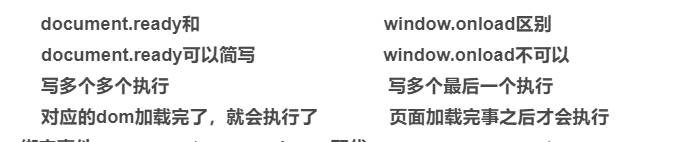
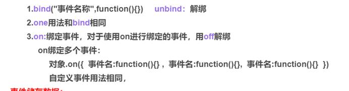
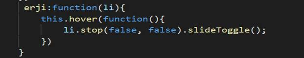
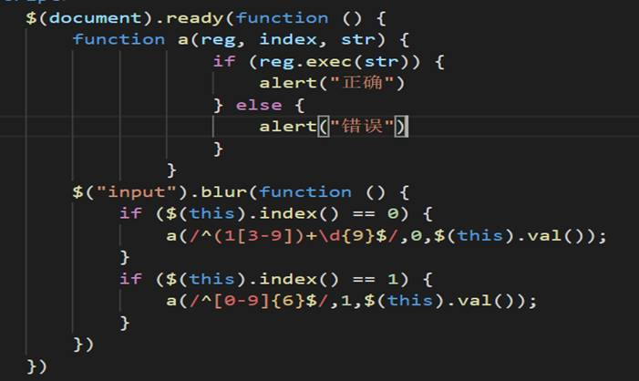
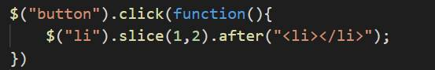

1,window.onload()与$(document).ready(function(){})的区别



2,绑定事件的方法有几种分别是什么?



3,写一个二级菜单插件



4,用jQuery写出表单验证:手机号,密码字母数字组合



5,用jQuery写tab(选项卡)切换图

```
$("ul li").click(function(){

  $($("#box").children()).hide().eq($(this).index()).show();

 })
```

6,用jQuery写出图片滚动

function startScroll(){

​    if($('div').scrollLeft()>=800){

​      $('div').scrollLeft(0)

​        }

​    $('div').scrollLeft($oDom.scrollLeft()+i)

​      }

​    setInterval(startScroll,10)

7,写出trigger()和triggerHander()区别

trigger():在每一个匹配的元素上触发某类事件。

triggerHandler():这个特别的方法将会触发指定的事件类型上所有绑定的处理函数。

8,如何使一个div显示,三秒后消失

$("div").show().delay("3000").fadeOut();

9,用jQuery 在第二个li与第三个li中间插入一个li



10,用jQuery写出获取 选择盒子的值

Console.log( $ (“input”) .val ( ) )